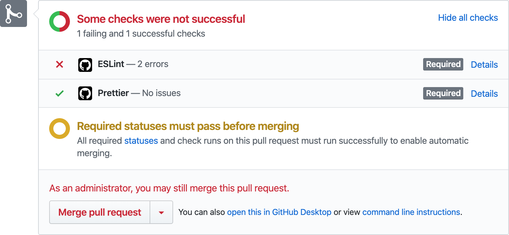
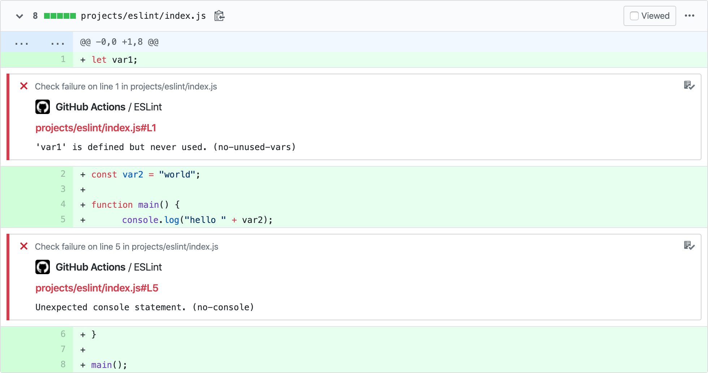
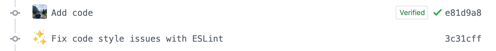

# ✨ Lint Action

- **Shows linting errors** on GitHub commits and PRs
- Allows **auto-fixing** issues
- Supports [many linters and formatters](#supported-tools)

_**Note:** The behavior of actions like this one is currently limited in the context of forks. See [Limitations](#limitations)._

## Screenshots

- Checks on pull requests:

  

- Commit annotations:

  

## Supported tools

- **C:**
  - [ClangFormat](https://clang.llvm.org/docs/ClangFormat.html)
- **C++:**
  - [ClangFormat](https://clang.llvm.org/docs/ClangFormat.html)
- **C#:**
  - [dotnet-format](https://github.com/dotnet/format)
- **CSS:**
  - [stylelint](https://stylelint.io)
- **Go:**
  - [gofmt](https://golang.org/cmd/gofmt)
  - [golint](https://github.com/golang/lint)
- **JavaScript:**
  - [ESLint](https://eslint.org)
  - [Prettier](https://prettier.io)
  - [XO](https://github.com/xojs/xo)
- **Objective-C:**
  - [ClangFormat](https://clang.llvm.org/docs/ClangFormat.html)
- **Objective-C++:**
  - [ClangFormat](https://clang.llvm.org/docs/ClangFormat.html)
- **PHP:**
  - [PHP_CodeSniffer](https://github.com/squizlabs/PHP_CodeSniffer)
- **Python:**
  - [Autopep8](https://github.com/hhatto/autopep8)
  - [Black](https://black.readthedocs.io)
  - [Flake8](http://flake8.pycqa.org)
  - [Mypy](https://mypy.readthedocs.io/)
  - [oitnb](https://pypi.org/project/oitnb/)
  - [Pylint](https://pylint.pycqa.org)
- **Ruby:**
  - [ERB Lint](https://github.com/Shopify/erb-lint)
  - [RuboCop](https://rubocop.readthedocs.io)
- **Rust:**
  - [clippy](https://github.com/rust-lang/rust-clippy)
  - [rustfmt](https://github.com/rust-lang/rustfmt)
- **Swift:**
  - [swift-format](https://github.com/apple/swift-format) (official)
  - [SwiftFormat](https://github.com/nicklockwood/SwiftFormat) (by Nick Lockwood)
  - [SwiftLint](https://github.com/realm/SwiftLint)
- **TypeScript:**
  - [tsc](https://www.typescriptlang.org/docs/handbook/compiler-options.html)
- **VB.NET:**
  - [dotnet-format](https://github.com/dotnet/format)

## Usage

Create a new GitHub Actions workflow in your project, e.g. at `.github/workflows/lint.yml`. The content of the file should be in the following format:

```yml
name: Lint

on:
  # Trigger the workflow on push or pull request,
  # but only for the main branch
  push:
    branches:
      - main
  # Replace pull_request with pull_request_target if you
  # plan to use this action with forks, see the Limitations section
  pull_request:
    branches:
      - main

# Down scope as necessary via https://docs.github.com/en/actions/security-guides/automatic-token-authentication#modifying-the-permissions-for-the-github_token
permissions:
  checks: write
  contents: write

jobs:
  run-linters:
    name: Run linters
    runs-on: ubuntu-latest

    steps:
      - name: Check out Git repository
        uses: actions/checkout@v3

      # Install your linters here

      - name: Run linters
        uses: wearerequired/lint-action@v2
        with:
          # Enable your linters here
```

## Examples

All linters are disabled by default. To enable a linter, simply set the option with its name to `true`, e.g. `eslint: true`.

The action doesn't install the linters for you; you are responsible for installing them in your CI environment.

### JavaScript example (ESLint and Prettier)

```yml
name: Lint

on:
  # Trigger the workflow on push or pull request,
  # but only for the main branch
  push:
    branches:
      - main
  pull_request:
    branches:
      - main

jobs:
  run-linters:
    name: Run linters
    runs-on: ubuntu-latest

    steps:
      - name: Check out Git repository
        uses: actions/checkout@v3

      - name: Set up Node.js
        uses: actions/setup-node@v1
        with:
          node-version: 12

      # ESLint and Prettier must be in `package.json`
      - name: Install Node.js dependencies
        run: npm ci

      - name: Run linters
        uses: wearerequired/lint-action@v2
        with:
          eslint: true
          prettier: true
```

**Important:** Make sure to exclude the `.github` directory in your ESLint and Prettier configs as the default `GITHUB_TOKEN` **cannot** be used to update workflow files due to the missing `workflow` permission. See [Limitations](#limitations).

### PHP example (PHP_CodeSniffer)

```yml
name: Lint

on:
  # Trigger the workflow on push or pull request,
  # but only for the main branch
  push:
    branches:
      - main
  pull_request:
    branches:
      - main

jobs:
  run-linters:
    name: Run linters
    runs-on: ubuntu-latest

    steps:
      - name: Check out Git repository
        uses: actions/checkout@v3

      - name: Set up PHP
        uses: shivammathur/setup-php@v2
        with:
          php-version: "7.4"
          coverage: none
          tools: phpcs

      - name: Run linters
        uses: wearerequired/lint-action@v2
        with:
          php_codesniffer: true
          # Optional: Ignore warnings
          php_codesniffer_args: "-n"
```

If you prefer to use [Composer](https://getcomposer.org/) you can also use this:

```yml
name: Lint

on:
  # Trigger the workflow on push or pull request,
  # but only for the main branch
  push:
    branches:
      - main
  pull_request:
    branches:
      - main

jobs:
  run-linters:
    name: Run linters
    runs-on: ubuntu-latest

    steps:
      - name: Check out Git repository
        uses: actions/checkout@v3

      - name: Set up PHP
        uses: shivammathur/setup-php@v2
        with:
          php-version: "7.4"
          coverage: none
          tools: composer

      - name: Install PHP dependencies
        run: |
          composer install --prefer-dist --no-progress --no-ansi --no-interaction
          echo "${PWD}/vendor/bin" >> $GITHUB_PATH

      - name: Run linters
        uses: wearerequired/lint-action@v2
        with:
          php_codesniffer: true
```

### Python example (Flake8 and Black)

```yml
name: Lint

on:
  # Trigger the workflow on push or pull request,
  # but only for the main branch
  push:
    branches:
      - main
  pull_request:
    branches:
      - main

jobs:
  run-linters:
    name: Run linters
    runs-on: ubuntu-latest

    steps:
      - name: Check out Git repository
        uses: actions/checkout@v3

      - name: Set up Python
        uses: actions/setup-python@v1
        with:
          python-version: 3.8

      - name: Install Python dependencies
        run: pip install black flake8

      - name: Run linters
        uses: wearerequired/lint-action@v2
        with:
          black: true
          flake8: true
```

### C, C++, Objective-C and Objective-C++ example (clang_format)

```yml
name: Lint

on:
  # Trigger the workflow on push or pull request,
  # but only for the main branch
  push:
    branches:
      - main
  pull_request:
    branches:
      - main

jobs:
  run-linters:
    name: Run linters
    runs-on: ubuntu-latest

    steps:
      - name: Check out Git repository
        uses: actions/checkout@v3

      - name: Install ClangFormat
        run: sudo apt-get install -y clang-format

      - name: Run linters
        uses: wearerequired/lint-action@v2
        with:
          clang_format: true
```

### C# and VB.NET example (dotnet_format)

```yml
name: Lint

on:
  # Trigger the workflow on push or pull request,
  # but only for the main branch
  push:
    branches:
      - main
  pull_request:
    branches:
      - main

jobs:
  run-linters:
    name: Run linters
    runs-on: ubuntu-latest

    steps:
      - name: Check out Git repository
        uses: actions/checkout@v3

      - name: Set up .NET
        uses: actions/setup-dotnet@v1
        with:
          dotnet-version: "6.0.x"

      - name: Run linters
        uses: wearerequired/lint-action@v2
        with:
          dotnet_format: true
```

### AutoFix example

```yml
name: Lint

on:
  # Trigger the workflow on push or pull request,
  # but only for the main branch
  push:
    branches:
      - main
  pull_request:
    branches:
      - main

jobs:
  run-linters:
    name: Run linters
    runs-on: ubuntu-latest

    steps:
      - name: Check out Git repository
        uses: actions/checkout@v3

      - name: Set up Python
        uses: actions/setup-python@v1
        with:
          python-version: 3.8

      - name: Install Python dependencies
        run: pip install black flake8

      - name: Run linters
        uses: wearerequired/lint-action@v2
        with:
          auto_fix: true
          black: true
          black_auto_fix: true
          flake8: true
          flake8_auto_fix: false
```

With `auto_fix` set to `true`, by default the action will try and fix code issues automatically and commit and push them automatically. Here however, `flake8` linter does not support auto-fixing, so setting `flake8_auto_fix` to `false` will prevent any unnecessary warnings.

## Configuration

### Linter-specific options

`[linter]` can be one of `autopep8`, `black`, `clang_format`, `dotnet_format`, `erblint`, `eslint`, `flake8`, `gofmt`, `golint`, `mypy`, `oitnb`, `php_codesniffer`, `prettier`, `pylint`, `rubocop`, `stylelint`, `swift_format_official`, `swift_format_lockwood`, `swiftlint` and `xo`:

- **`[linter]`:** Enables the linter in your repository. Default: `false`
- **`[linter]_args`**: Additional arguments to pass to the linter. Example: `eslint_args: "--max-warnings 0"` if ESLint checks should fail even if there are no errors and only warnings. Default: `""`
- **`[linter]_dir`**: Directory where the linting command should be run. Example: `eslint_dir: server/` if ESLint is installed in the `server` subdirectory. Default: Repository root
- **`[linter]_extensions`:** Extensions of files to check with the linter. Example: `eslint_extensions: js,ts` to lint JavaScript and TypeScript files with ESLint. Default: Varies by linter, see [`action.yml`](./action.yml)
- **`[linter]_command_prefix`:** Command prefix to be run before the linter command. Default: `""`.
- **`[linter]_auto_fix`:** Whether the linter should try to fix code style issues automatically. This option is useful to commit and push changes only for specific linters and not all of them when `auto_fix` option is set. Default: `true` if linter supports auto-fixing, `false` if not.

### General options

- **`github_token`:** The `GITHUB_TOKEN` to [authenticate on behalf of GitHub Actions](https://docs.github.com/en/free-pro-team@latest/actions/reference/authentication-in-a-workflow#using-the-github_token-in-a-workflow). Defaults to the GitHub token.

- **`continue_on_error`:** Whether the workflow run should also fail when linter failures are detected. Default: `true`

- **`auto_fix`:** Whether linters should try to fix code style issues automatically. If some issues can be fixed, the action will apply the needed changes. Default: `false`

  <p align="center">
    
  </p>

- **`commit`:** Whether to commit and push the changes made by `auto_fix`. Default: `true`

- **`git_name`**: Username for auto-fix commits. Default: `"Lint Action"`

- **`git_email`**: Email address for auto-fix commits. Default: `"lint-action@samuelmeuli.com"`

- **`git_no_verify`**: Bypass the pre-commit and pre-push git hooks. Default: `false`

- **`commit_message`**: Template for auto-fix commit messages. The `${linter}` variable can be used to insert the name of the linter. Default: `"Fix code style issues with ${linter}"`

- **`check_name`**: Template for the [name of the check run](https://docs.github.com/en/rest/reference/checks#create-a-check-run). Use this to ensure unique names when the action is used more than once in a workflow. The `${linter}` and `${dir}` variables can be used to insert the name and directory of the linter. Default: `"${linter}"`

- **`neutral_check_on_warning`:** Whether the check run should conclude with a neutral status instead of success when the linter finds only warnings. Default: `false`

### Linter support

Some options are not available for specific linters:

| Linter                | auto-fixing | extensions |
| --------------------- | :---------: | :--------: |
| autopep8              |     ✅      |  ❌ (py)   |
| black                 |     ✅      |     ✅     |
| clang_format          |     ✅      |     ✅     |
| clippy                |     ✅      |  ❌ (rs)   |
| dotnet_format         |     ✅      |  ❌ (cs)   |
| erblint               |     ❌      |  ❌ (erb)  |
| eslint                |     ✅      |     ✅     |
| flake8                |     ❌      |     ✅     |
| gofmt                 |     ✅      |  ❌ (go)   |
| golint                |     ❌      |  ❌ (go)   |
| mypy                  |     ❌      |  ❌ (py)   |
| oitnb                 |     ✅      |     ✅     |
| php_codesniffer       |     ❌      |     ✅     |
| prettier              |     ✅      |     ✅     |
| pylint                |     ❌      |  ❌ (py)   |
| rubocop               |     ✅      |  ❌ (rb)   |
| rustfmt               |     ✅      |  ❌ (rs)   |
| stylelint             |     ✅      |     ✅     |
| swift_format_official |     ✅      |     ✅     |
| swift_format_lockwood |     ✅      | ❌ (swift) |
| swiftlint             |     ✅      | ❌ (swift) |
| tsc                   |     ❌      |  ❌ (ts)   |
| xo                    |     ✅      |     ✅     |

## Limitations

### Pull requests

There are currently some limitations as to how this action (or any other action) can be used in the context of `pull_request` events from forks:

- The action doesn't have permission to push auto-fix changes to the fork. This is because the `pull_request` event runs on the upstream repo, where the `github_token` is lacking permissions for the fork. [Source](https://github.community/t5/GitHub-Actions/Can-t-push-to-forked-repository-on-the-original-repository-s/m-p/35916/highlight/true#M2372)
- The action doesn't have permission to create annotations for commits on forks unless you use the `pull_request_target` event. You can modify the default permissions granted to the `GITHUB_TOKEN` by using the `permissions` key and set the `checks` scope to `write`. See [GitHub documentation](https://docs.github.com/en/actions/learn-github-actions/workflow-syntax-for-github-actions#permissions) for more.

### Auto-fixing workflow files

If `auto_fix` is enabled and the default `GITHUB_TOKEN` is used, none of the linters should be allowed to change files in `.github/workflows` as the token doesn't have the necessary `workflow` permission. This can be achieved by adding the directory to the ignore config of the used linter. [Source](https://github.community/t/github-linting-remote-rejected/121365)

For details and comments, please refer to [#65](https://github.com/wearerequired/lint-action/issues/65) and [#74](https://github.com/wearerequired/lint-action/issues/74).

<br>

[](https://required.com/en/lets-get-in-touch/)
